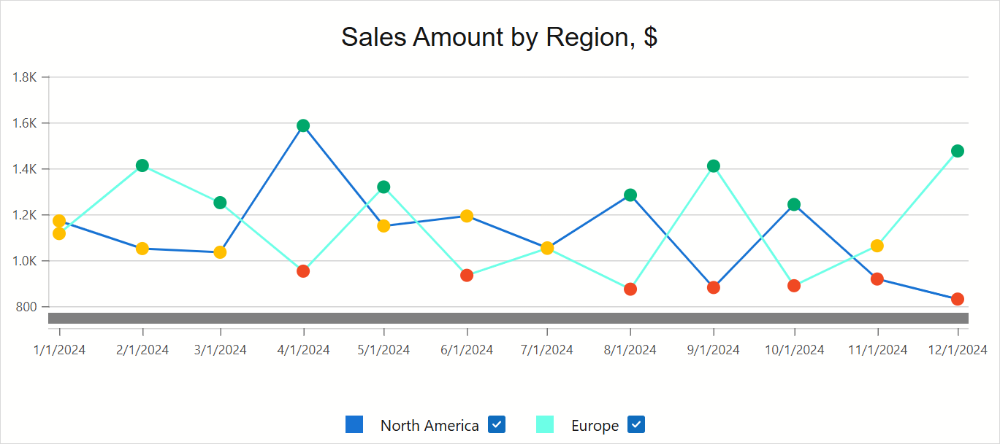

<!-- default badges list -->

[](https://supportcenter.devexpress.com/ticket/details/T1297772)
[](https://docs.devexpress.com/GeneralInformation/403183)
[](#does-this-example-address-your-development-requirementsobjectives)
<!-- default badges end -->
# Blazor Chart - Create and Configure a Line Chart

This example uses the DevExpress Blazor Chart component to create and customize a multi-line chart. A [DataTable](https://learn.microsoft.com/en-us/dotnet/api/system.data.datatable) object supplies chart data.



## Implementation Details

### Add a Chart and Populate It with Data

To begin, place a [DxChart](https://docs.devexpress.com/Blazor/DevExpress.Blazor.DxChart-1) component on the page ([Index.razor](CS/BlazorDxChartBoilerplateExample/Components/Pages/Index.razor)) and add [line series objects](https://docs.devexpress.com/Blazor/DevExpress.Blazor.DxChartLineSeries-3) to chart markup. 

This example generates series in a loop and binds them to specific regions in the [DataTable](/CS/BlazorDxChartBoilerplateExample/Components/Pages/Index.razor#L45-L87) using `Data` properties. `ArgumentField` and `ValueField` properties use lambda expressions to retrieve data from each table row (using the corresponding column name).

```Razor
<DxChart T="object" Width="70%">
    @* ... *@
    @foreach (var region in regionNames) {
        <DxChartLineSeries Data="@(regionSeriesData[region])"
                           ArgumentField='(DataRow row) => (DateTime)row["Month"]'
                           ValueField='(DataRow row) => (int)row["Amount"]'
                           Width="2"
                           Color="@(region == "Europe" ? ColorTranslator.FromHtml("#6DFFE7") :
                                                         ColorTranslator.FromHtml("#1873D3"))"
                           Name="@region">
        </DxChartLineSeries>
    }
</DxChart>
```

### Extend Functionality and Apply Customizations

The DevExpress Blazor Chart component (`DxChart`) allows you to extend chart capabilities and configure descriptive elements as necessary. This example applies the following changes:

* Adds a [chart title](https://docs.devexpress.com/Blazor/405093/components/charts/descriptive-elements/descriptive-elements#titles-and-subtitles):
    ```Razor
    <DxChartTitle Text="Sales Amount by Region, $" />
    ```
* Configures [legend](https://docs.devexpress.com/Blazor/405093/components/charts/descriptive-elements/descriptive-elements#legend) settings and allows users to toggle series visibility (via the `AllowToggleSeries` property):
    ```Razor
    <DxChartLegend Position="RelativePosition.Outside"
                   AllowToggleSeries="true"
                   VerticalAlignment="VerticalEdge.Bottom" />
    ```
* Formats [argument axis labels](https://docs.devexpress.com/Blazor/405083/components/charts/labels#axis-labels):
    ```Razor
    <DxChartArgumentAxis>
        <DxChartAxisLabel Format="ChartElementFormat.ShortDate" />
    </DxChartArgumentAxis>
    ```
* Adds and formats [chart tooltips](https://docs.devexpress.com/Blazor/405093/components/charts/descriptive-elements/descriptive-elements#tooltips):
    ```Razor
    <DxChartTooltip Enabled="true">
        @context.Point.Render((seriesPoint) =>
            @<div style="margin: 0.75rem">
                <div>@seriesPoint.SeriesName</div>
                <span>@($"{seriesPoint.Argument: MMMM yyyy}: ")</span>
                <span>@($"{seriesPoint.Value: $0}K")</span>
            </div>
        )
    </DxChartTooltip>
    ```
* Enables [zoom/pan operations](https://docs.devexpress.com/Blazor/405057/components/charts/chart/zoom) for both argument and value axes and adds a scroll bar:
    ```Razor
    <DxChartZoomAndPanSettings ArgumentAxisZoomAndPanMode="ChartAxisZoomAndPanMode.Both" />
    <DxChartScrollBarSettings ArgumentAxisScrollBarVisible="true"
                              ArgumentAxisScrollBarPosition="ChartScrollBarPosition.Bottom" />
    ```

This example also changes individual series point colors using the [CustomizeSeriesPoint](https://docs.devexpress.com/Blazor/DevExpress.Blazor.DxChartBase.CustomizeSeriesPoint) event:

```Razor
<DxChart T="object"
         CustomizeSeriesPoint="CustomizeSeriesPoint">
    @* ... *@
</DxChart>

@code {
    // ...
    protected void CustomizeSeriesPoint(ChartSeriesPointCustomizationSettings e) {
        int value = (int)((ChartSeriesPoint<object>)e.Point).Value;
        var color = ColorTranslator.FromHtml("#00A86B");
        if (value < 1200)
            color = ColorTranslator.FromHtml("#FFBF00");
        if (value < 1000)
            color = ColorTranslator.FromHtml("#F04923");
        e.PointAppearance.Color = color;
    }
}
```

## Files to Review

- [Index.razor](CS/BlazorDxChartBoilerplateExample/Components/Pages/Index.razor)

## Documentation

- [DxChart Class](https://docs.devexpress.com/Blazor/DevExpress.Blazor.DxChart-1)
- [Get Started with Charts](https://docs.devexpress.com/Blazor/401769/components/charts/get-started-with-charts)
- [Series Types](https://docs.devexpress.com/Blazor/405041/components/charts/series-types)
- [Descriptive Elements](https://docs.devexpress.com/Blazor/405093/components/charts/descriptive-elements/descriptive-elements)
- [Customization](https://docs.devexpress.com/Blazor/405098/components/charts/customization)
- [Zoom Operations](https://docs.devexpress.com/Blazor/405057/components/charts/chart/zoom)

<!-- feedback -->
## Does this example address your development requirements/objectives?

[](https://www.devexpress.com/support/examples/survey.xml?utm_source=github&utm_campaign=blazor-chart-create-and-configure-line-chart&~~~was_helpful=yes) [](https://www.devexpress.com/support/examples/survey.xml?utm_source=github&utm_campaign=blazor-chart-create-and-configure-line-chart&~~~was_helpful=no)

(you will be redirected to DevExpress.com to submit your response)
<!-- feedback end -->
