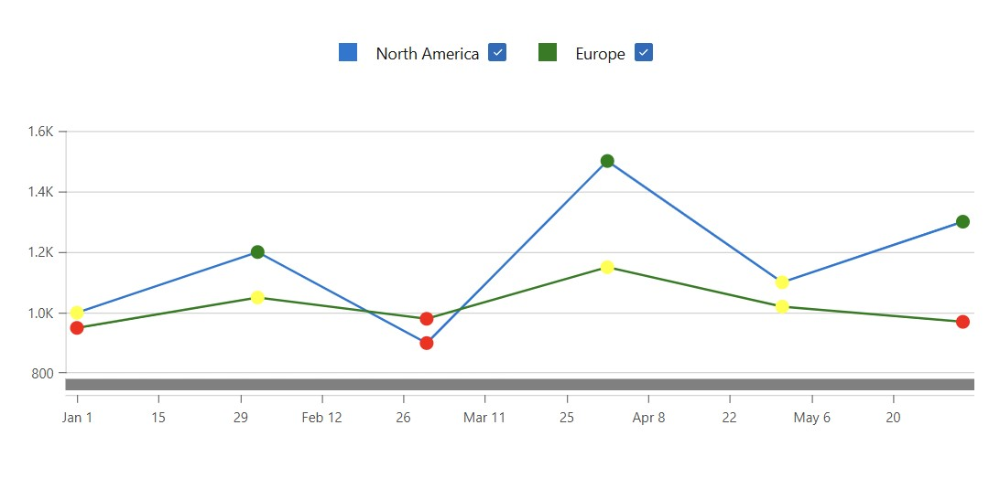

<!-- default badges list -->

<!-- default badges end -->
# Blazor Chart - Boilerplate example
A lightweight example for testing common chart use cases.

This example makes use of DxChart's properties and implementation concepts that can easily be tested and modified:

- Multiple line series implemented using `foreach` iteration
- Data-Binding - Bind in-line DataTable to chart
- Chart Legend - Toggle series visibility functionality ([AllowToggleSeries](https://docs.devexpress.com/Blazor/DevExpress.Blazor.DxChartLegend.AllowToggleSeries))
- Chart Tooltip - Display data on points when hovered on
- Customize Series Points - Apply distinct colors on series points depending on the corresponding value

## Implementation Details

Add the [DxChart](https://docs.devexpress.com/Blazor/DevExpress.Blazor.DxChart-1) component to the [Index](CS/BlazorDxChartBoilerplateExample/Components/Pages/Index.razor) page. The chart is bound to a manually created [DataTable](https://learn.microsoft.com/en-us/dotnet/api/system.data.datatable) that simulates runtime data for multiple regions across dates.

Use a `foreach` loop to dynamically generate a separate [DxChartLineSeries](https://docs.devexpress.com/Blazor/DevExpress.Blazor.DxChartLineSeries-3) for each unique region in the DataTable. Each series binds its argument and value using lambda expressions to extract values from each DataRow.

### Customize Series Appearance

- Enable [AllowToggleSeries](https://docs.devexpress.com/Blazor/DevExpress.Blazor.DxChartLegend.AllowToggleSeries) to allow users to show/hide series via the legend.
- Configure the [DxChartTooltip](https://docs.devexpress.com/Blazor/DevExpress.Blazor.DxChartTooltip) component to display region-specific data when a user hovers over a data point.
- Customize the appearance of individual points within a series using the [`CustomizeSeriesPoint`](https://docs.devexpress.com/Blazor/DevExpress.Blazor.DxChartBase.CustomizeSeriesPoint) event. Points are conditionally colored based on their data values (e.g., highlight values greater than a threshold).

### Runtime Data Binding

Since the example uses a [DataTable](https://learn.microsoft.com/en-us/dotnet/api/system.data.datatable) instead of a strongly typed list, the `ArgumentField` and `ValueField` properties use lambda expressions to access values by column name (`x => x["Region"]`, `x => x["Value"]`, etc.).

This approach allows you to simulate or modify data structures easily during testing without updating model classes.

## Files to Review

- [Index.razor](CS/BlazorDxChartBoilerplateExample/Components/Pages/Index.razor)

## Documentation

- [DxChart Class](https://docs.devexpress.com/Blazor/DevExpress.Blazor.DxChart-1)

<!-- feedback -->
## Does this example address your development requirements/objectives?

 

(you will be redirected to DevExpress.com to submit your response)
<!-- feedback end -->
